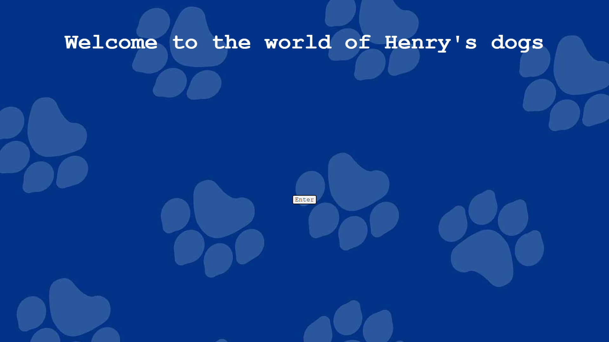
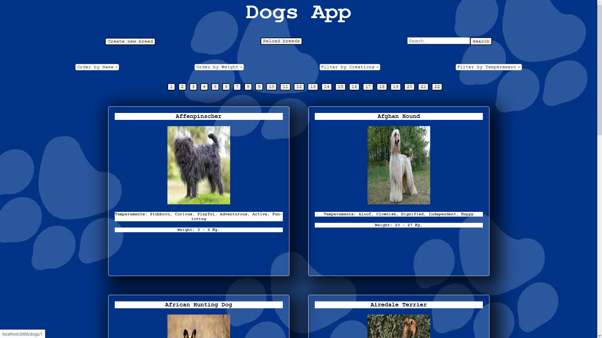
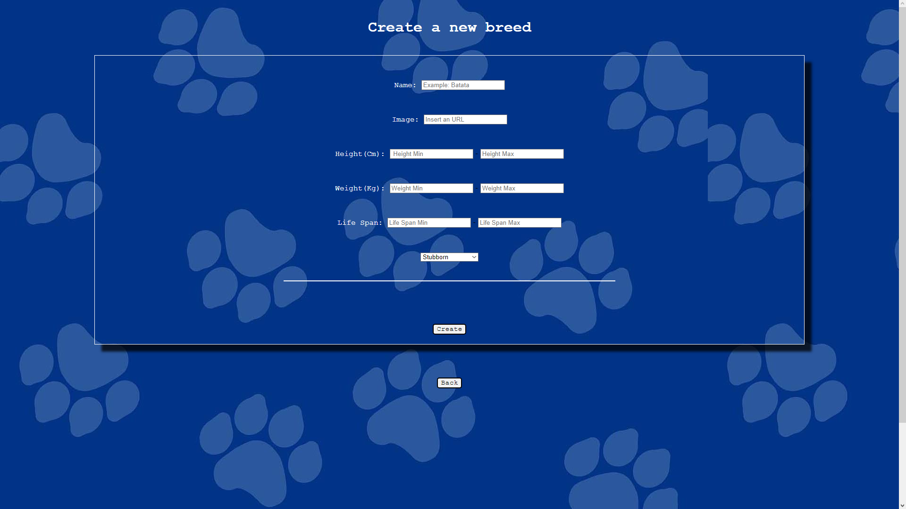
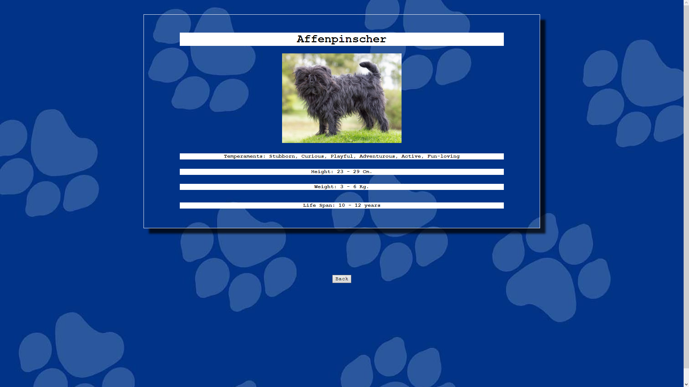

# Individual Project - Henry Dogs

<p align="left">
  
</p>

## Objetivos del Proyecto

- Build an App using React, Redux, Node and Sequelize.
- Affirm and connect the concepts learned in the race.
- Learn best practices.
- Learn and practice the GIT workflow.
- Use and practice testing.

## Landing: 

As a first impression we can see a home page that has a title and a button that will redirect us to the main page.



## Home: 

This is the main page where we can see many cards preloaded with dog breeds. We also have options to filter by breeds created by ourselves or already existing and the option to filter by temperaments. A search bar and options to sort by name and weight. We also have a button to reload the cards and a button that redirects us to the creation form of a new breed. If you click on a card's name or image, you will be redirected to the dog's detail page.



## Form: 

The form page has several fields to fill in, each one validated so that a new breed cannot be created without completing all the fields.



## Detail

On this page we can see the detailed information about the breed of dog that we select.




### Quick Start 

1. Fork the repository to have a copy of it in your accounts
2. Clone the repository on your computers to start working


Currently the required versions are:

 * __Node__: 12.18.3 or older
 * __NPM__: 6.14.16 or older

In `api` create a file called: `.env` that has the following form:

```
DB_USER=usuariodepostgres
DB_PASSWORD=passwordDePostgres
DB_HOST=localhost
```

Replace `postgresuser` and `postgrespassword` with your own credentials to connect to postgres

Additionally, it will be necessary to create a database called `dogs` from psql

* Run the next commands in file root:

* npm install

* npm start

* Open http://localhost:3000 in your browser

The `client` content was created using: Create React App.

### Endpoints/Flags used

  - https://api.thedogapi.com/v1/breeds
  - https://api.thedogapi.com/v1/breeds/search?q={raza_perro}


#### Credits:
- React
- Redux
- Express
- Sequelize - Postgres
